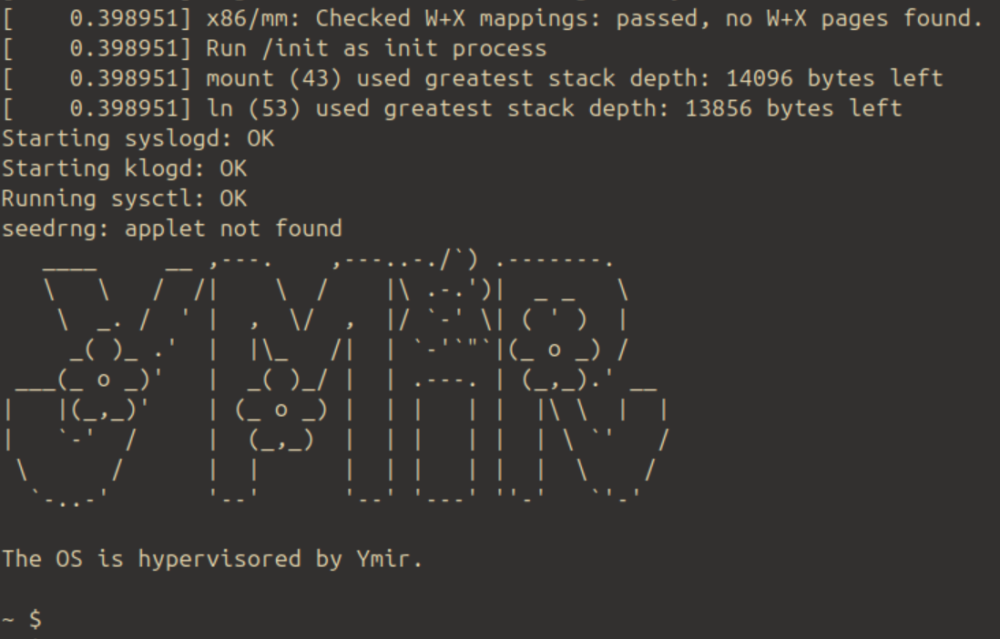

# Ymir: The Type-1 Hypervisor


Ymir is an Intel VT-x based baremetal hypervisor written in Zig.
It is minimalistic but can boot latest Linux kernel (v6.9).



## Features

- Supports Intel x64 architecture.
- Can boot latest Linux kernel with initramfs.
- Uses EPT (Extended Page Tables) for memory virtualization.
- Super thin (passthrough) and minimalistic hypervisor.
- No dependencty. Everything is written from scratch in Zig.

## Limitations / Future Work

- No support of SMP.
- No support of APIC and other fundamental features.
- Can boot only Linux kernel with [x86 boot protocol](https://www.kernel.org/doc/html/v6.1/x86/boot.html).
- Can host only one VM at a time.
- And many more...

## Requirements

Install `ovmf` package to run UEFI firmware on QEMU:

```sh
sudo apt install ovmf
```

## Development

```sh
zig build run -Dlog_level=info -Doptimize=ReleaseFast
```

You need to put your kernel image (`bzImage`) and initramfs (`initramfs.cpio`) to `/zig-out/img`.
It is tested that Ymir can boot Linux kernel v6.9 that is compiled with `defconfig` of x86-64.
